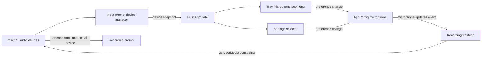

# Microphone Device Selection

**Date:** 2026-08-01
**Status:** Approved for planning

## Problem

macOS makes output-device switching readily accessible, but input-device selection is buried in System Settings. A SayType user can therefore start dictating without knowing whether audio is coming from the MacBook microphone, AirPods, a display, a webcam, or a USB interface. When transcription quality suddenly changes, the user has no quick way to confirm or correct the input source.

SayType currently asks `getUserMedia` for the system-default input at the start of every recording. The persisted `microphone` setting remains fixed at `"default"`; it is exposed in the settings payload but is not applied to capture and has no UI.

## Product Goal

Make the active microphone visible and switchable from SayType without making microphone configuration part of normal setup.

The default experience remains zero-configuration. Users who never change microphones continue to follow the system default automatically. Users with AirPods, docks, monitors, webcams, USB microphones, or audio interfaces gain a direct way to inspect and switch the input source.

## Non-goals

- No microphone priority ranking in the first version.
- No automatic switch merely because a new device appears.
- No mandatory microphone choice during onboarding.
- No continuous audio capture for device monitoring.
- No OS notification for every device connection or disconnection.
- No changes to output-device routing.

## User Experience

### Tray menu

Add a `Microphone` submenu below `Engine`.

The first item is:

- `Automatic (System Default)`

Available input devices follow, each using the name reported by the operating system. The saved preference has a checkmark. If a saved device is unavailable, the submenu retains an unavailable entry for that preference and also indicates that SayType will temporarily use the system default.

Selecting an entry applies it to the next recording and persists the preference immediately. An in-progress recording is never interrupted or switched mid-stream.

The tray remains English-only, matching the existing tray menu.

### Settings

Replace the microphone-permission-only row with an `Input microphone` row that contains:

- the current preference,
- a select control with `Automatic (System Default)` and available devices,
- the existing permission status and repair action.

The selector is not shown during onboarding. It is a convenience control, not a required setup step.

The settings selector and tray submenu reflect the same persisted preference. A change from either surface updates the other without requiring an app restart.

### Recording prompt

When recording starts, show the microphone actually used for capture as secondary text, for example `MacBook Microphone`. The primary state remains `Listening`; the device name must not compete with the transcription status.

The displayed name comes from the opened audio track, not only from the saved preference, so fallback behavior is truthful.

### Device changes

SayType watches the media-device inventory without keeping an audio stream open. Device monitoring must not activate the macOS microphone indicator.

- A newly connected device is added to the tray and settings lists, but SayType does not switch to it automatically.
- If the saved device disappears, future recordings fall back to the system default. The saved preference is retained so reconnecting the device restores it automatically.
- If the system default changes while the preference is `Automatic`, the next recording uses the new default.
- Device changes never interrupt an active recording.

## Architecture

### Frontend device manager

The always-created `input-prompt` window owns microphone discovery because it already owns `getUserMedia` and the recording lifecycle.

A small device-manager unit in the input-prompt frontend will:

1. call `navigator.mediaDevices.enumerateDevices()` after microphone permission is available,
2. retain only `audioinput` entries,
3. listen for `navigator.mediaDevices.devicechange`,
4. send sanitized device snapshots to Rust,
5. resolve a captured track's device ID to a display label,
6. degrade safely when enumeration or device-change events are unsupported.

The manager observes device metadata only. It must not open a media stream to monitor connections. SayType's existing launch prime remains the only non-recording `getUserMedia` call and still stops its track immediately.

### Rust state and tray

Rust stores the latest frontend-reported device snapshot in `AppState`. The snapshot contains only device IDs and display labels; it contains no audio data.

The tray menu is rebuilt when:

- the device snapshot changes,
- the microphone preference changes,
- existing settings or updater state already requires a refresh.

Dynamic tray item IDs map to device IDs through Rust state rather than embedding raw device IDs in menu identifiers. This avoids assumptions about allowed menu-ID characters and keeps event handling deterministic.

### Persisted preference

The existing `AppConfig.microphone` field becomes active:

- `"default"` means follow the system default,
- any other value is a specific `MediaDeviceInfo.deviceId`.

Older configurations remain compatible because the existing default is already `"default"`. Unknown or unavailable IDs are valid saved preferences and trigger temporary fallback instead of a destructive reset.

Use a dedicated microphone-preference command for tray and settings changes. It performs a read-modify-write operation so callers never need API keys and cannot overwrite unrelated configuration.

After persistence, Rust emits a microphone-update event to the windows and refreshes the tray.

### Recording constraints

The recording frontend builds constraints per recording:

- automatic preference: use the existing audio constraints unchanged,
- specific preference: add `deviceId: { exact: selectedDeviceId }`.

If exact acquisition fails because the preferred device is absent, retry once with the existing automatic constraints. Other capture failures retain the current error handling. The selected preference is not overwritten by fallback.

After capture succeeds, read the audio track settings to determine the actual device used and update the recording prompt.

## Data Flow

## Error Handling

- **Permission not granted:** show the existing permission state and repair action; list labels may be unavailable until permission is granted.
- **Enumeration unsupported:** keep `Automatic (System Default)` usable and hide or disable specific-device selection with a short explanation.
- **Preferred device unavailable:** retain the preference, record from the system default, and show the actual fallback device in the prompt.
- **Device removed during recording:** let the existing stream lifecycle and error handling finish; do not attempt a mid-recording switch.
- **Duplicate or empty labels:** provide stable generic labels such as `Microphone 1`, `Microphone 2` for the current snapshot.
- **Snapshot report failure:** recording still works with the last saved preference or automatic fallback; tray refresh failure is non-fatal.

## Privacy

Device monitoring listens only for device inventory changes and does not capture sound. Audio streams continue to be opened only for the existing launch prime and explicit recordings, and tracks continue to be stopped immediately after use.

No device list, device name, or device identifier leaves the local machine.

## Testing

### Unit tests

- normalize and deduplicate reported input devices,
- preserve `"default"` and specific microphone preferences through config serialization,
- update only the microphone field through the dedicated command,
- map dynamic tray item IDs to the correct device preference,
- represent an unavailable saved preference without losing it,
- build exact versus automatic capture constraints,
- retry automatic capture only for a missing preferred device.

### Manual macOS validation

1. Start with only the built-in microphone and verify automatic capture.
2. Connect and disconnect AirPods, a USB microphone, and a display/webcam microphone.
3. Verify lists update without activating the microphone indicator.
4. Select each device from the tray and confirm the next recording uses it.
5. Select each device from Settings and confirm the tray checkmark updates.
6. Disconnect the selected device and verify automatic fallback without losing the preference.
7. Reconnect the preferred device and verify the next recording returns to it.
8. Change the macOS default while SayType is set to automatic and verify the next recording follows it.
9. Change devices during an active recording and verify the recording is not deliberately interrupted.
10. Verify permission-denied, no-device, busy-device, and unsupported-enumeration states.

## Release Scope

The first release includes tray selection, settings selection, actual-device visibility in the recording prompt, device-inventory monitoring, and safe fallback. Priority ordering, automatic ranking, live level meters, and richer device-change notifications are deferred until real usage demonstrates the need.
